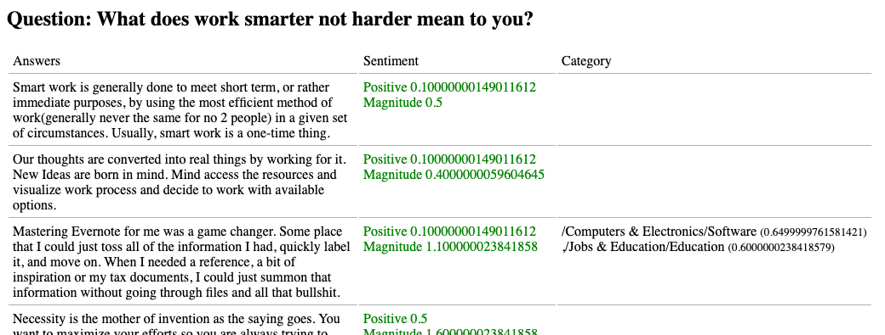

# Survey Answer Analyser
App analysing survey answers for sentiments. An improvment would be to expand the model with classifications making it possible to detect subjects in more details like methodology, culture, social, technicals, marketing, sales, business...

## Spin up locally
* Ensure docker with docker-compose are installed and running
* Open terminal in project root and run `docker-compose up`
* Docker will pull, build and start the container
* Access web client on: http://localhost:80

## Analyse questions
* Add Google Natural Language API credentials to project root in a file named: `gcloud_credentials.json`
* Add any new questions and answers you like to analyse to file `./model/questions.json`
* Run command `npm run analyse`
* The analysed result will be stored in `./model/questions_analysed.json`
